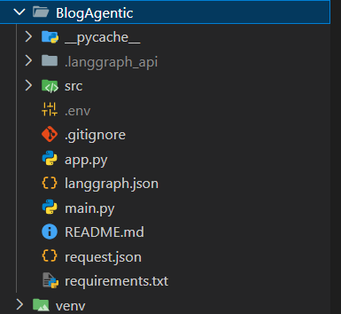
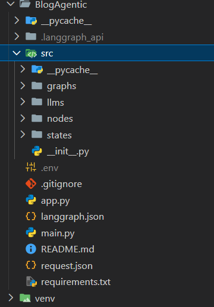
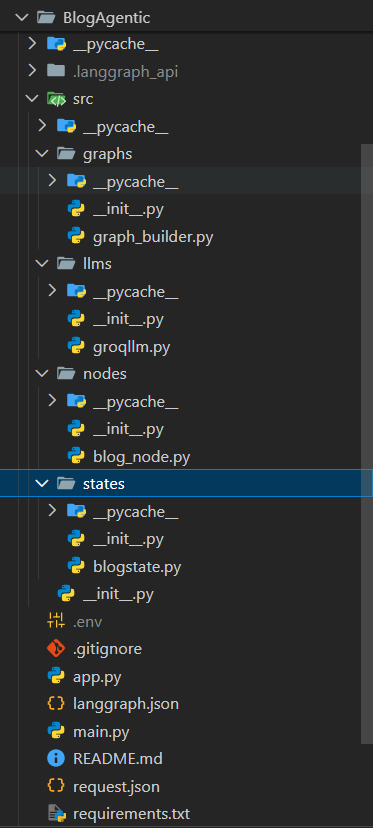
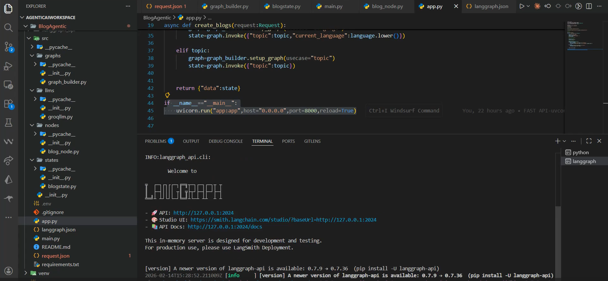
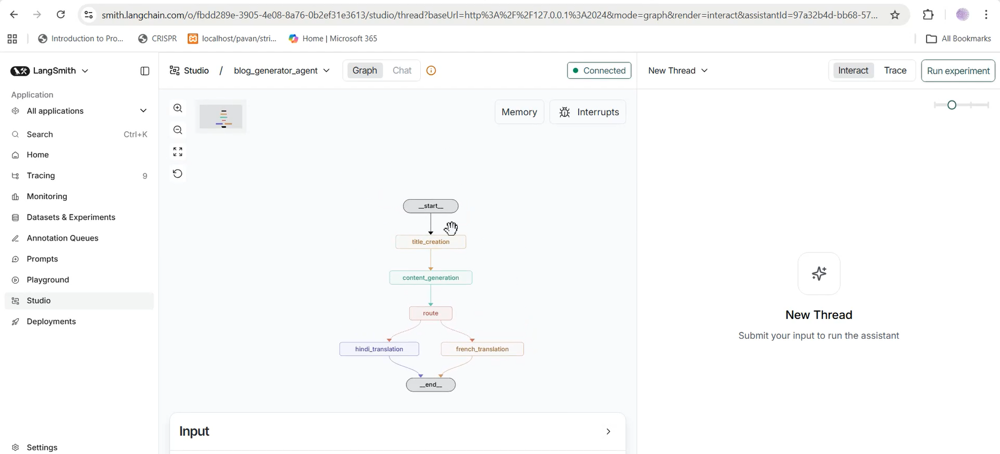
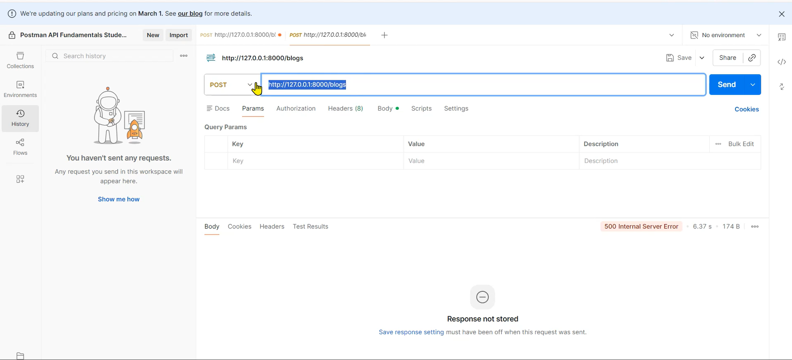
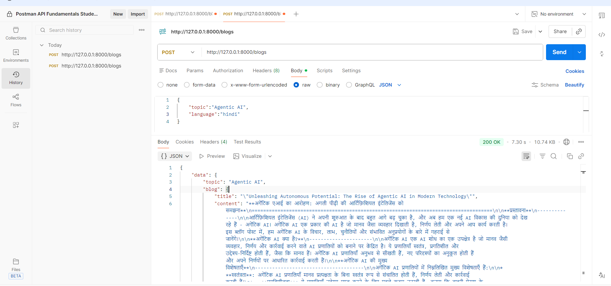
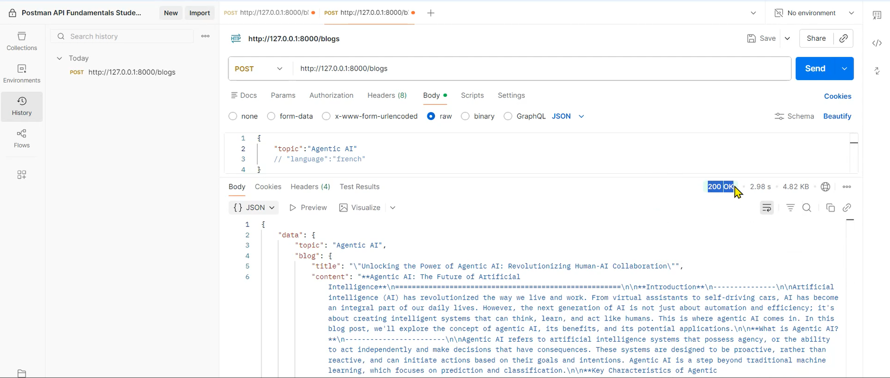
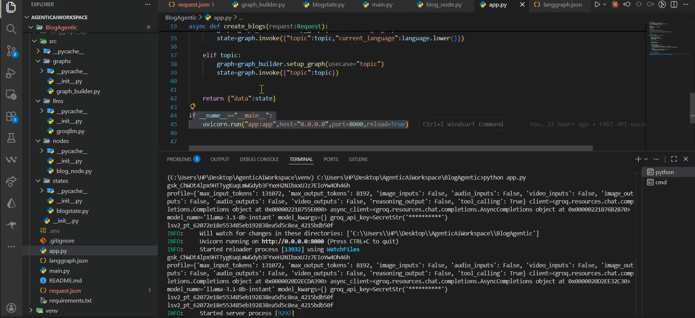

# ✍️ END to END BlogAgentic : AI-Powered Multi-Lingual Content Generator

[](https://www.python.org/)


[](https://groq.com/)

**BlogAgentic** is a state-of-the-art AI agent designed to generate high-quality blog content and provide seamless translations across **English, French, and Hindi**. Built with **FastAPI** and **LangGraph**, it utilizes a state-machine architecture to handle content creation and linguistic routing.

---

## 🚀 Demo & Walkthrough
* **Video Demo:** [Watch on Loom](https://www.loom.com/share/b3759ec6979e4120bcb866cb7a32edf6)
* **API Base URL:** `http://127.0.0.1:8000/blogs`

---

## ✨ Features
* 🤖 **Agentic Content Creation**: Automatically generates structured blog posts based on a provided topic.
* 🌐 **Multi-Lingual Support**: Integrated translation nodes for **Hindi** and **French**.
* ⚡ **High-Speed Inference**: Powered by **Groq (Llama 3)** for near-instant content generation.
* 🔗 **Stateful Workflow**: Built with **LangGraph** to manage the pipeline from title creation to final translation.
* 📡 **FastAPI Integration**: Robust REST API for easy integration with frontend or external services.

---

## 🖼️ Project Visuals

### 📂 Folder Structure & Architecture
| Base Structure | Internal Source | Sub-modules |
| :---: | :---: | :---: |
|  |  |  |

---

### 🗺️ LangGraph Workflow & Tracing
The agent's logic is visualized through the LangGraph state machine and monitored via LangSmith.

| LangGraph Logic | LangSmith Tracing |
| :---: | :---: |
|  |  |

---

### 🧪 API Testing (Postman)
Validation of the FastAPI endpoints for English, French, and Hindi content generation.

| Endpoint Setup | Response Body | Translation Output |
| :---: | :---: | :---: |
|  |  |  |

---

### 📡 FastAPI Server Output
The final JSON response structure as seen in the browser or API client.



## 🛠️ Tech Stack

### 🧠 Core Orchestration


### 🤖 AI Inference & Agents


### 📡 Backend & Tooling


---

## 📂 Project Structure
```text
BlogAgentic/
├── src/
│   ├── graphs/             # Workflow definitions
│   │   └── graph_builder.py
│   ├── llms/               # LLM configurations (Groq/OpenAI)
│   │   └── groqllm.py
│   ├── nodes/              # Agent logic (Title, Content, Translation)
│   │   └── blog_node.py
│   └── states/             # State management
│       └── blogstate.py
├── app.py                  # FastAPI Application Entry
├── langgraph.json          # LangGraph Cloud/Studio configuration
├── main.py                 # Core execution logic
├── request.json            # Sample API request format
└── requirements.txt        # Project dependencies
```

## 🧪 API Usage (Postman)
> Endpoint: POST http://127.0.0.1:8000/blogs

### 1. Generate English Blog (Default)
Request Body:
```json
{
    "topic": "Agentic AI"
}
```
### 2. Generate & Translate (French/Hindi)
Request Body:
```json
{
    "topic": "Agentic AI",
    "language": "french / hindi"
}
```
## ⚙️ Installation & Setup
### 1. Clone & Navigate
```bash
git clone https://github.com/rathod-0007/AgenticChatbot.git
cd BlogAgentic
```

### 2. Install Dependencies
```bash
pip install -r requirements.txt
```
### 3. Environment Variables
Add your keys to a .env file:
```bash
GROQ_API_KEY=your_key
OPENAI_API_KEY=your_key
```

### 4. Run the Server
```bash
python app.py
```
> Server will start at http://0.0.0.0:8000 with hot-reload enabled.

## 🗺️ Agent Workflow

The system operates as a stateful directed acyclic graph (DAG) using **LangGraph**. Each step represents a specialized node that modifies the shared `BlogState`.


### 🔄 The Pipeline
* **1. 🏷️ Title Creation**: The agent analyzes the `topic` and generates a catchy, SEO-friendly title.
* **2. 📝 Content Generation**: Using the generated title, this node writes a comprehensive blog post.
* **3. 🚦 Router**: A conditional logic node that inspects the `language` field in the state.
* **4. 🌍 Translation Nodes**: 
    * If `language` is **Hindi**, the state is routed to the `hindi_translation` node.
    * If `language` is **French**, it routes to the `french_translation` node.
    * If no translation is requested, the workflow proceeds directly to the **End**.

---

### 📥 API Input Format (`request.json`)
You can trigger the workflow via the FastAPI endpoint using this JSON structure:

```json
{
    "topic": "Agentic AI",
    "language": "hindi" 
}
```
> Note: The language field is optional. If omitted, the agent will return the content in English by default.